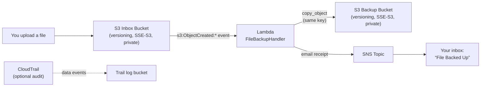

# Personal File Backup — Event-Driven Backup Pipeline on AWS

A Dropbox-style personal backup: upload a file to an S3 **inbox** bucket and it is
automatically copied to a **backup** bucket, then you get an email receipt.
No servers, no cron jobs — pure event-driven serverless.



## How it works

1. **Upload** any file to the inbox bucket (console, CLI, or SDK).
2. S3 fires an `ObjectCreated:*` event → **FileBackupHandler** Lambda.
3. The Lambda **copies the object to the backup bucket** preserving the key,
   original metadata, and AES-256 encryption, and tags it with
   `copied-from=<inbox>` and `copied-at=<timestamp>`.
4. The Lambda **publishes an SNS email** — *"File Backed Up"* — with bucket,
   key, size, and backup time.
5. Any copy/notify failure **raises**, so the S3 event retries the record
   (copies are idempotent: reprocessing overwrites the same backup key).

Logs are single-line structured JSON (`{"service":"personal-file-backup", "event":"copied", ...}`)
so you can query them in CloudWatch Logs Insights.

## Project layout

```
personal-file-backup/
├── template.yaml   # AWS SAM template (buckets, Lambda, SNS, optional CloudTrail)
├── src/
│   └── app.py      # Lambda handler
├── tests/
│   └── test_app.py # pytest suite (mocked boto3 + template smoke checks)
└── README.md
```

## Deploy

Prerequisites: [AWS SAM CLI](https://docs.aws.amazon.com/serverless-application-model/latest/developerguide/install-sam-cli.html),
AWS credentials configured, and a confirmed email address.

```bash
sam build
sam deploy --guided
```

During `--guided`, supply:

| Parameter          | Value                                                  |
|--------------------|--------------------------------------------------------|
| `SourceBucketName` | globally unique inbox bucket name, e.g. `my-inbox-2402` |
| `BackupBucketName` | globally unique backup bucket name, e.g. `my-backup-2402` |
| `NotificationEmail`| the address that should receive backup receipts         |
| `EnableCloudTrail` | `false` (default) — set `true` to also log S3 data events |

After deploy, **confirm the SNS subscription** from the email AWS sends you —
receipts won't arrive until you click it. Then upload a file to the inbox
bucket and check for the *"File Backed Up"* email.

### Optional CloudTrail audit trail

`EnableCloudTrail=true` adds a CloudTrail trail that logs S3 data events for
both buckets into a dedicated log bucket (write-only events, no management
events). It is outside the AWS free tier — the only paid part of this project.

## Testing matrix

| # | Case | Action | Expected result |
|---|------|--------|-----------------|
| 1 | Happy path | Upload `photo.jpg` to the inbox bucket | Same key appears in backup bucket; *"File Backed Up"* email arrives; CloudWatch shows `{"event":"copied"}` |
| 2 | Duplicate event | S3 delivers the same notification twice | Second copy overwrites the same key; no error (idempotent) |
| 3 | Large object | Upload a multi-GB file (same region) | `s3.copy_object` is a server-side copy — no Lambda memory pressure |
| 4 | Permission error | Remove the Lambda's `PutObject` permission, then upload | Handler logs `copy_failed` and raises → event retries; fix the policy and confirm |
| 5 | Versioned rewrite | Upload the same key twice | Backup bucket keeps both versions (versioning on both sides) |
| 6 | Encryption | Inspect a backup object in the console | `Server-side encryption: AES256`, tags `copied-from`/`copied-at` present |
| 7 | Error visibility | Trigger case 4, then open CloudWatch Logs | Structured JSON lines: `copy_failed` → retry attempts → `copied` |
| 8 | Audit (optional) | Enable CloudTrail, upload a file | Trail log bucket receives a `PutObject`/`CopyObject` data-event record |

## Free-tier cost notes

Everything in the default configuration (`EnableCloudTrail=false`) fits in the
AWS free tier for a personal-use workload:

- **Lambda**: 1M requests + 400,000 GB-seconds/month free — a backup runs in
  ~200 ms at 256 MB, so tens of thousands of backups/month cost $0.
- **S3**: 5 GB standard storage, 20,000 GET + 2,000 PUT requests/month free
  (12 months for the request/storage allowances; always-free tier also applies).
- **SNS**: 1,000 email notifications/month free.
- **CloudWatch Logs**: 5 GB ingestion/month free — one JSON line per backup is negligible.

Realistic personal usage (a few hundred files/month, < 5 GB): **$0.00/month**.
The optional CloudTrail data-event logging is the only paid component.

## Enhancement ideas

- **Lifecycle rules**: transition old backups to S3 Glacier after 90 days.
- **Integrity check**: compare ETags of source and backup after copy; alert on mismatch.
- **Prefix filters**: only back up certain prefixes (e.g. `photos/`) via the S3 event filter.
- **Dead-letter queue**: route repeated failures to an SQS DLQ instead of relying on S3 retries.
- **Cross-region replication**: add CRR on the backup bucket for region-level durability.
- **Object Lock**: enable compliance mode on the backup bucket for ransomware-proof copies.
- **Weekly digest**: a scheduled Lambda summarizing backup counts instead of per-file emails.

## Portfolio deliverables checklist

- [ ] Screenshot: inbox bucket + backup bucket object lists after a test upload
- [ ] Screenshot: backup object **Properties** → tags (`copied-from`, `copied-at`) and SSE-S3 encryption
- [ ] Screenshot: CloudWatch log stream showing the `{"event":"copied"}` JSON line
- [ ] Screenshot: the *"File Backed Up"* SNS email in your inbox
- [ ] (Optional) Screenshot: CloudTrail event record for a backup data event
- [ ] GitHub repo with this code + README covering architecture, steps, tests, costs, enhancements
- [ ] Resume bullet: *"Built an event-driven AWS backup pipeline (S3, Lambda, SNS) with
      idempotent retries, least-privilege IAM, and optional CloudTrail audit logging — $0/month on the free tier"*
- [ ] LinkedIn post one-liner with the architecture diagram and repo link
