# Personal File Backup — Event-Driven Backup Pipeline on AWS

A Dropbox-style personal backup: upload a file to an S3 **inbox** bucket and it is
automatically copied to a **backup** bucket, then you get an email receipt.
No servers, no cron jobs — pure event-driven serverless.



## How it works

1. **Upload** any file to the inbox bucket (console, CLI, or SDK).
2. S3 fires an `ObjectCreated:*` event → **FileBackupHandler** Lambda.
3. The Lambda **copies the object to the backup bucket** preserving the key,
   original metadata, and server-side encryption (SSE-S3 by default, or SSE-KMS
   with your key — see Deploy), and tags it with
   `copied-from=<inbox>` and `copied-at=<timestamp>`.
4. The Lambda **publishes an SNS email** — *"File Backed Up"* — with bucket,
   key, size, backup version ID, and backup time.
5. Any copy/notify failure **raises**, so the S3 event retries the record
   (copies are idempotent: reprocessing overwrites the same backup key).
6. **Old versions age out**: a lifecycle rule deletes non-current versions
   after `NoncurrentVersionExpirationDays` (default 90) — versioning protects
   you from accidents, the lifecycle rule protects you from the bill.

Logs are single-line structured JSON (`{"service":"personal-file-backup", "event":"copied", ...}`)
so you can query them in CloudWatch Logs Insights.

## Restoring a file

The backup bucket is versioned, so every overwrite keeps the previous copy.
`scripts/restore.py` lists a key's versions and copies one back — to the inbox
bucket (or anywhere else) — so a bad overwrite is seconds to undo:

```bash
# List every version of a file, newest first
python scripts/restore.py list my-backup-2402 docs/report.pdf

# Restore version v3XYZ back into the inbox bucket under the same key
python scripts/restore.py restore my-backup-2402 docs/report.pdf v3XYZ \
  --to-bucket my-inbox-2402

# ...or save it under a different key to inspect first
python scripts/restore.py restore my-backup-2402 docs/report.pdf v3XYZ \
  --to-bucket my-inbox-2402 --to-key docs/report-restored.pdf
```

AWS CLI equivalent (no script needed):

```bash
aws s3api list-object-versions --bucket my-backup-2402 --prefix docs/report.pdf
aws s3api copy-object --bucket my-inbox-2402 --key docs/report.pdf \
  --copy-source 'my-backup-2402/docs/report.pdf?versionId=v3XYZ'
```

## Uploading large files (multipart)

S3 supports single PUTs only up to **5 GB**. For anything bigger, multipart
upload is the way — and it's transparent to this pipeline:

- **AWS CLI handles it automatically** for large files:
  `aws s3 cp big.iso s3://my-inbox-2402/` splits anything over 8 MB
  (`multipart_threshold`) into parallel parts and retries failed parts.
- Tune it in `~/.aws/config`: `multipart_threshold` / `multipart_chunksize`.
- Each completed upload fires one `ObjectCreated:CompleteMultipartUpload`
  event → one backup, one receipt — same as a small file.
- The Lambda's `copy_object` is server-side, so even a multi-GB object costs
  the Lambda nothing in memory or bandwidth.
- Stray incomplete uploads are cleaned up by the lifecycle rule after 7 days.

## Project layout

```
personal-file-backup/
├── template.yaml            # AWS SAM template (buckets, Lambda, SNS, optional CloudTrail)
├── src/
│   └── app.py               # Lambda handler
├── scripts/
│   └── restore.py           # list versions + restore a chosen version
├── tests/
│   ├── test_app.py          # pytest: Lambda handler + template smoke checks
│   └── test_restore.py      # pytest: restore script logic
├── .github/workflows/ci.yml # pytest + sam validate on push/PR
└── README.md
```

## Deploy

Prerequisites: [AWS SAM CLI](https://docs.aws.amazon.com/serverless-application-model/latest/developerguide/install-sam-cli.html),
AWS credentials configured, and a confirmed email address.

```bash
sam build
sam deploy --guided
```

During `--guided`, supply:

| Parameter                        | Value                                                                 |
|----------------------------------|-----------------------------------------------------------------------|
| `SourceBucketName`               | globally unique inbox bucket name, e.g. `my-inbox-2402`               |
| `BackupBucketName`               | globally unique backup bucket name, e.g. `my-backup-2402`             |
| `NotificationEmail`              | the address that should receive backup receipts                       |
| `EnableCloudTrail`               | `false` (default) — set `true` to also log S3 data events             |
| `NoncurrentVersionExpirationDays`| `90` (default) — days until old backup versions are deleted           |
| `KmsKeyArn`                      | empty (default = SSE-S3); set a KMS key ARN for SSE-KMS on the backup bucket |

For SSE-KMS you can use the AWS-managed S3 key
(`alias/aws/s3`, ARN form `arn:aws:kms:<region>:<account>:key/<id>`) or your own
CMK — the Lambda gets `kms:Encrypt`/`GenerateDataKey` on exactly that key, only
when the parameter is set. Note: SSE-KMS costs ~$1/month per key plus a tiny
per-request fee; SSE-S3 is free.

After deploy, **confirm the SNS subscription** from the email AWS sends you —
receipts won't arrive until you click it. Then upload a file to the inbox
bucket and check for the *"File Backed Up"* email.

### Optional CloudTrail audit trail

`EnableCloudTrail=true` adds a CloudTrail trail that logs S3 data events for
both buckets into a dedicated log bucket (write-only events, no management
events). It is outside the AWS free tier — the only paid part of this project.

## Testing matrix

| # | Case | Action | Expected result |
|---|------|--------|-----------------|
| 1 | Happy path | Upload `photo.jpg` to the inbox bucket | Same key appears in backup bucket; *"File Backed Up"* email arrives; CloudWatch shows `{"event":"copied"}` |
| 2 | Duplicate event | S3 delivers the same notification twice | Second copy overwrites the same key; no error (idempotent) |
| 3 | Large object | Upload a multi-GB file (same region) | `s3.copy_object` is a server-side copy — no Lambda memory pressure |
| 4 | Permission error | Remove the Lambda's `PutObject` permission, then upload | Handler logs `copy_failed` and raises → event retries; fix the policy and confirm |
| 5 | Versioned rewrite | Upload the same key twice | Backup bucket keeps both versions (versioning on both sides) |
| 6 | Encryption | Inspect a backup object in the console | `Server-side encryption: AES256` (or `aws:kms` if `KmsKeyArn` set), tags `copied-from`/`copied-at` present |
| 7 | Error visibility | Trigger case 4, then open CloudWatch Logs | Structured JSON lines: `copy_failed` → retry attempts → `copied` |
| 8 | Audit (optional) | Enable CloudTrail, upload a file | Trail log bucket receives a `PutObject`/`CopyObject` data-event record |
| 9 | Restore | Overwrite a key, then `python scripts/restore.py restore ...` with the old version ID | Previous version copied back to the inbox bucket; listed as newest in `restore.py list` |

## Free-tier cost notes

Everything in the default configuration (`EnableCloudTrail=false`) fits in the
AWS free tier for a personal-use workload:

- **Lambda**: 1M requests + 400,000 GB-seconds/month free — a backup runs in
  ~200 ms at 256 MB, so tens of thousands of backups/month cost $0.
- **S3**: 5 GB standard storage, 20,000 GET + 2,000 PUT requests/month free
  (12 months for the request/storage allowances; always-free tier also applies).
- **SNS**: 1,000 email notifications/month free.
- **CloudWatch Logs**: 5 GB ingestion/month free — one JSON line per backup is negligible.

Realistic personal usage (a few hundred files/month, < 5 GB): **$0.00/month**.
The optional CloudTrail data-event logging is the only paid component.

## Enhancement ideas

- **Integrity check**: compare ETags of source and backup after copy; alert on mismatch.
- **Prefix filters**: only back up certain prefixes (e.g. `photos/`) via the S3 event filter.
- **Dead-letter queue**: route repeated failures to an SQS DLQ instead of relying on S3 retries.
- **Cross-region replication**: add CRR on the backup bucket for region-level durability.
- **Object Lock**: enable compliance mode on the backup bucket for ransomware-proof copies.
- **Weekly digest**: a scheduled Lambda summarizing backup counts instead of per-file emails.

